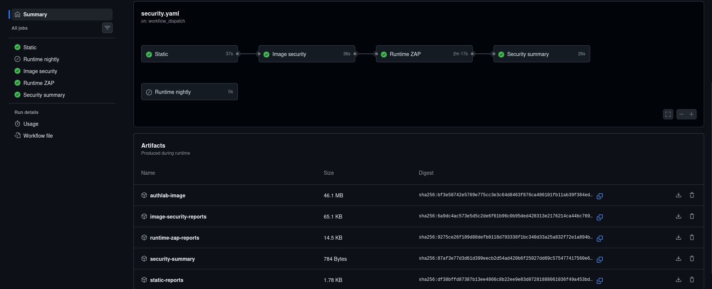
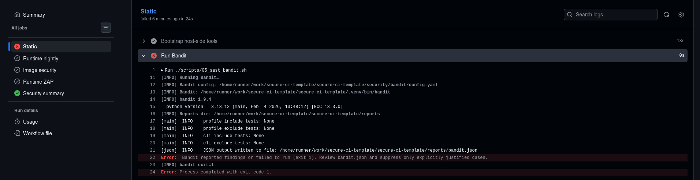
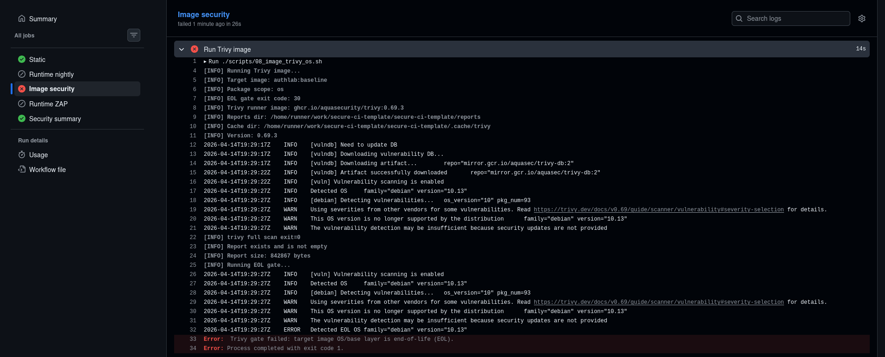
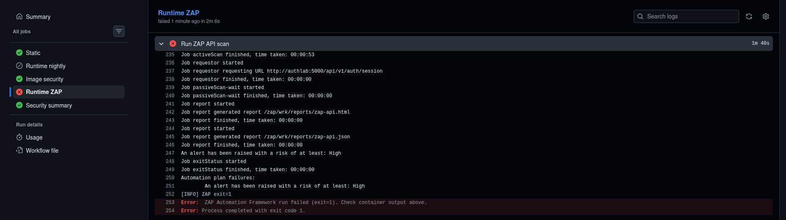

# Security pipeline red/green demo

## 1. Purpose

This document demonstrates how the repository security pipeline behaves in representative green and red scenarios.

---

## 2. Demo scope

This document includes:

- a green baseline run
- representative red blocking scenarios tied to the project policy
- optional signal-only behavior where findings are recorded but do not block

It is not an exhaustive catalog of every possible failure mode.

---

## 3. Green baseline

A manual `workflow_dispatch` run on `main` was used as the baseline green case.

This demonstrates that the reviewed repository state passes the main CI path and produces the expected report set.



...

## 4. Red scenarios

### 4.1 Red: static blocking

For this demo case, a reviewed Bandit suppression was temporarily removed from an existing lab-only SQLi PoC path.

```diff
- sql = f"SELECT id, name, price FROM products WHERE name LIKE '%{q}%';"  # nosec
+ sql = f"SELECT id, name, price FROM products WHERE name LIKE '%{q}%';"
```
This demonstrates that once the suppression is removed, the Bandit finding becomes blocking under the current project policy.



### 4.2 Red: image-security blocking

For this demo case, the base image was temporarily changed to an EOL Debian-based tag.

```diff
- FROM python:3.13-slim
+ FROM python:3.10-slim-buster
```
This demonstrates that the image-security stage blocks when the repository is built on top of an end-of-life OS/base image under the current project policy.




### 4.3 Red: runtime-zap blocking

For this demo case, the product search path was temporarily changed from parameterized SQL handling to direct string interpolation for the `q` filter in the lab API route used for security validation.

```diff
-        filters.append("name LIKE ? COLLATE NOCASE")
-        params.append(f"%{q}%")
+        filters.append(f"name LIKE '%{q}%' COLLATE NOCASE")
```
This demonstrates that the runtime-zap stage blocks when an intentionally introduced SQL injection surface is present on the scanned route under the current project policy.


